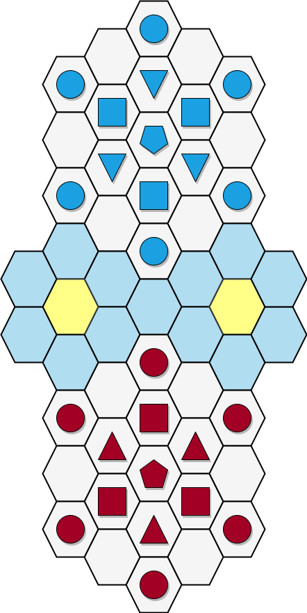
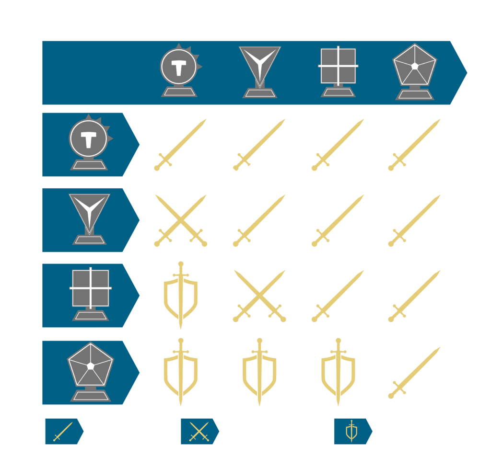
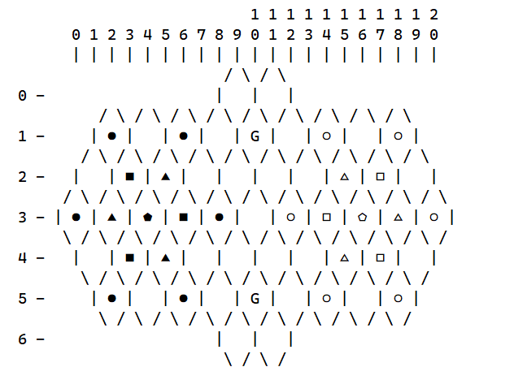
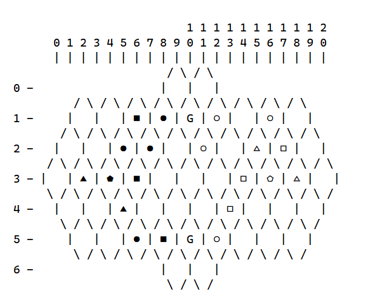
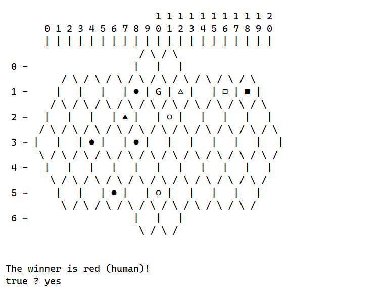
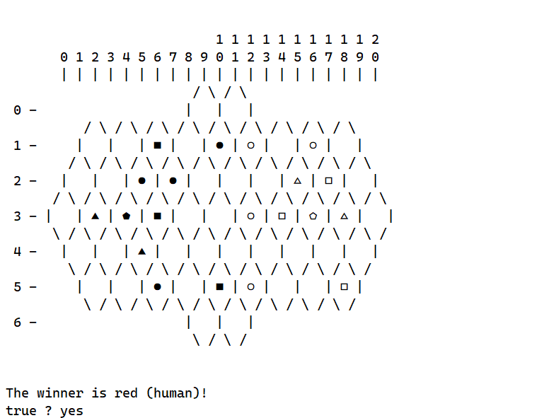

# TP1 - PFL 23/24

## Group Information
- **Game**: Tactigon
- **Group**: 2

| Student number | Full name                  | Contribution |
| -------------- | -------------------------- | ------------ |
| 202108791      | Daniel José de Aguiar Gago | 50%          |
| 202108729      | José Miguel Sereno Santos  | 50%          |

## Installation and Execution
To run the game in both Linux and Windows environments, follow these steps:

1. Install [SICStus Prolog 4.8](https://sicstus.sics.se/download4.html).
2. Consult the `main.pl` file located in the `/src` directory by clicking on File -> Consult.
3. If you are using Linux, choose the font `FreeMono` with font size `14` in Settings -> Font. If you are using Windows. choose the font `Cascadia Mono` with font size `14` in Settings -> Font.
4. Use the starting predicate `play/0` to start the program.
```
| ?- play.
```

## Description of the Game

Tactigon is turn-based 2-player board game where each side (Red and Blue) has four types of pieces. They are the Circle, the Triangle, the Square, and the Pentagon. 

### Board Set Up

Each player starts with 6 Circles, 3 Triangles, 3 Squares and 1 Pentagon.

During initial setup, the pieces are placed according to the following diagram:



### Gameplay

#### Movement

- Usually, Red moves first, but it's up to the players to decide. 

- A turn consists of a player moving one of their pieces, and resolving any combat that may result from that movement.

- Pieces can move in any path and direction up to their maximum spaces (E.g a move does not need to be done in a straight line). The maximum spaces a piece can move is dictated by the following table:

| Piece    | Max spaces per turn |
| -------- | ------------------- |
| Circle   | 1 space             |
| Triangle | 3 spaces            |
| Square   | 4 spaces            |
| Pentagon | 5 spaces            |

- Pieces cannot jump over other pieces.


#### Combat

- Pieces enter combat when a player moves one of their pieces into a tile occupied by an enemy piece.

- Combat ends a player's turn (the piece cannot continue moving afterwards).

- Combat has two potential outcomes:
  1. The defending piece is captured.
  2. Both the atacking and defending pieces are captured.

- When a piece is captured, it is removed from the board and cannot return.

- The outcome of each combat is indicated by the following table:



### Objective

Achieving victory can be done in 2 ways.

1. Capturing the opposing Pentagon: if this piece is captured, the game instantly ends and the player that captured the Pentagon is the winner.

2. Gold Tile Victory: occupying both golden tiles at the **end** of your opponent's turn wins the game.

## Game Logic

### Internal Game State Representation

The Gamestate is an essential argument for all main predicates. It is composed of Board and Turn. The Board is a non-quadratic matrix that contains all board elements, including tiles, pieces, and the number -1, which means non-existent. Board tiles are either 1 or 2 followed by a unit number. A tile is marked as 10 if it is an empty normal tile and 20 if it is golden and empty.

RedPlayer units are numbered from 1 to 4, while BluePlayer units are numbered between 5 and 8. Specifically, 1 and 5 represent pentagons, 2 and 6 represent squares, 3 and 7 represent triangles, and 4 and 8 represent circles.

In the board display, figures are used instead of numbers. Red side uses black-colored figures, and Blue side uses white figures.

**Initial Game State:**
```
    Board = [
    [-1,-1,-1,-1,-1,-1,-1,-1,-1,10,-1,10,-1,-1,-1,-1,-1,-1,-1,-1,-1],
    [-1,-1,14,-1,10,-1,14,-1,10,-1,20,-1,10,-1,18,-1,10,-1,18,-1,-1],
    [-1,10,-1,12,-1,13,-1,10,-1,10,-1,10,-1,10,-1,17,-1,16,-1,10,-1],
    [14,-1,13,-1,11,-1,12,-1,14,-1,10,-1,18,-1,16,-1,15,-1,17,-1,18],
    [-1,10,-1,12,-1,13,-1,10,-1,10,-1,10,-1,10,-1,17,-1,16,-1,10,-1],
    [-1,-1,14,-1,10,-1,14,-1,10,-1,20,-1,10,-1,18,-1,10,-1,18,-1,-1],
    [-1,-1,-1,-1,-1,-1,-1,-1,-1,10,-1,10,-1,-1,-1,-1,-1,-1,-1,-1,-1]
    ],
    Turn = red.
```





**Middle Game State:**

```
    Board = [
    [-1,-1,-1,-1,-1,-1,-1,-1,-1,10,-1,10,-1,-1,-1,-1,-1,-1,-1,-1,-1],
    [-1,-1,10,-1,10,-1,12,-1,14,-1,20,-1,18,-1,10,-1,18,-1,10,-1,-1],
    [-1,10,-1,10,-1,14,-1,14,-1,10,-1,18,-1,10,-1,17,-1,16,-1,10,-1],
    [10,-1,13,-1,11,-1,12,-1,10,-1,10,-1,10,-1,16,-1,15,-1,17,-1,10],
    [-1,10,-1,10,-1,13,-1,10,-1,10,-1,10,-1,16,-1,10,-1,10,-1,10,-1],
    [-1,-1,10,-1,10,-1,14,-1,12,-1,20,-1,18,-1,10,-1,10,-1,10,-1,-1],
    [-1,-1,-1,-1,-1,-1,-1,-1,-1,10,-1,10,-1,-1,-1,-1,-1,-1,-1,-1,-1]
    ],
    Turn = blue.
```




**Final Game State**

There are two possible end game states:

  1. Capturing Pentagon
  ```
  Board = [
    [-1,-1,-1,-1,-1,-1,-1,-1,-1,10,-1,10,-1,-1,-1,-1,-1,-1,-1,-1,-1],
    [-1,-1,10,-1,10,-1,10,-1,14,-1,20,-1,17,-1,10,-1,16,-1,12,-1,-1],
    [-1,10,-1,10,-1,10,-1,13,-1,10,-1,18,-1,10,-1,10,-1,10,-1,10,-1],
    [10,-1,10,-1,11,-1,10,-1,14,-1,10,-1,10,-1,10,-1,10,-1,10,-1,10],
    [-1,10,-1,10,-1,10,-1,10,-1,10,-1,10,-1,10,-1,10,-1,10,-1,10,-1],
    [-1,-1,10,-1,10,-1,14,-1,10,-1,28,-1,10,-1,10,-1,10,-1,10,-1,-1],
    [-1,-1,-1,-1,-1,-1,-1,-1,-1,10,-1,10,-1,-1,-1,-1,-1,-1,-1,-1,-1]
    ]
  ```
  

  2. Occupying both golden tiles after enemy turn
  
  ```
  Board = [
    [-1,-1,-1,-1,-1,-1,-1,-1,-1,10,-1,10,-1,-1,-1,-1,-1,-1,-1,-1,-1],
    [-1,-1,10,-1,10,-1,12,-1,10,-1,24,-1,18,-1,10,-1,18,-1,10,-1,-1],
    [-1,10,-1,10,-1,14,-1,14,-1,10,-1,10,-1,10,-1,17,-1,16,-1,10,-1],
    [10,-1,13,-1,11,-1,12,-1,10,-1,10,-1,18,-1,16,-1,15,-1,17,-1,10],
    [-1,10,-1,10,-1,13,-1,10,-1,10,-1,10,-1,10,-1,10,-1,10,-1,10,-1],
    [-1,-1,10,-1,10,-1,14,-1,10,-1,22,-1,18,-1,10,-1,10,-1,16,-1,-1],
    [-1,-1,-1,-1,-1,-1,-1,-1,-1,10,-1,10,-1,-1,-1,-1,-1,-1,-1,-1,-1]
    ]
  ```
    

## GameState Visualizer

After executing **play/0** , user(s) will be presented a menu where they can choose the mode they want. <br>

      A- Gamemode(H vs H / H vs M / M vs H / M vs M) 
      B- Bot Difficulty Level 

All these options require user input, therefore, a validation predicate was created.

In menu.pl, mode selection validation in the following way:

```
% process_menu_input/0
process_menu_input:-
  repeat,
  write('Select an Option: '),
  read(Option),
  process_menu_input(Option).

% process_menu_input/0
process_menu_input(1):- start_game(human, human).
process_menu_input(2):- difficulty(human, machine).
process_menu_input(3):- difficulty(machine, human).
process_menu_input(4):- difficulty(machine, machine).  

```

Bot difficulty validation is done in the following way:

```

  Missing code

```

After mode and bot difficulty choice, the game is initiated by the predicate **start_game/2** found in `game.pl`.

```
  % start_game(+CurrPlayer, +NextPlayer)
  start_game(CurrPlayer, NextPlayer):-  
    initial_state( _ , GameState),
    game_loop(GameState, CurrPlayer, NextPlayer).
```

After initializing the GameState, the board is drawn for the first time. After each executed move, the board is displayed again using the **display_board/1** predicate found in `display.pl`.

```
  % display_game(+Board)
  display_game(Board):-
    clear_screen,  % clears console
    nl, nl,
    display_x_coords(Board), % displays X axis
    display_lines(Board), % displays Y axis and draws board with pieces
    nl, nl.
```

To display the pieces, it was necessary to create a predicate to obtain piece information called **get_piece/4**, which can be found in `utils.pl`.


```
% get_piece(?Id, ?Piece, ?Colour, ?PieceDisplay)
get_piece(1, pentagon, red, '\x2B1F\').
get_piece(2, square, red, '\x25A0\').
get_piece(3, triangle, red, '\x25B2\').
get_piece(4, circle, red, '\x25CF\').

get_piece(5, pentagon, blue, '\x2B20\').
get_piece(6, square, blue, '\x25A1\').
get_piece(7, triangle, blue, '\x25B3\').
get_piece(8, circle, blue, '\x25CB\').

```

While in-game, if the selected mode involves a human player, coordinates input will also need to be validated. In input, only if it follows the X-Y structure. 
This verification is done by the predicate **read_coordinates/2** in `game.pl`.

```
  % read_move(+X1-Y1-X2-Y2)
  read_move(X1-Y1-X2-Y2):-
    read_coordinates('Source', X1-Y1),
    read_coordinates('Dest', X2-Y2).

  % read_coordinates(+Type, +X-Y)
  read_coordinates(Type, X-Y):-
    format('~a coordinates (format X-Y): ', Type),
    read(X-Y).
```


## Move Validation and Execution

The game works based on a loop that only stops when victory is achieved. In the **game_loop/3** in `game.pl`, users, if playing, are asked to input their moves using the **read_move/1** predicate. If user input is valid, the move is then validated using the **valid_move/4** predicate.

```
% game_loop(+GameState, +CurrPlayer, +NextPlayer)
game_loop([Board, Turn], CurrPlayer, NextPlayer):-
  game_over([Board, Turn], Winner), !,
  display_game(Board),
  get_player_type(Winner, CurrPlayer, NextPlayer, WinnerType),
  display_winner(Winner, WinnerType).
game_loop([Board, Turn], human, NextPlayer):-
  display_game(Board),
  repeat,
  read_move(Move),
  move([Board, Turn], Move, NewGameState),
  game_loop(NewGameState, NextPlayer, human).
game_loop([Board, Turn], machine, NextPlayer):-
  display_game(Board),
  write('The machine is thinking...'),
  sleep(1),
  choose_move([Board, Turn], machine, 1, Move),
  move([Board, Turn], Move, NewGameState),
  game_loop(NewGameState, NextPlayer, machine).

```

To validate a move, you need to adhere to the following rules:

1. Source coordinates are valid, meaning that the tile contains a piece belonging to the player.
2. Destination coordinates are valid, meaning that there are no pieces of the player in that tile.
3. The path is valid, which means that the destination coordinates are within range and there is a possible path to them.
4. If there is a combat in the destination coordinates, it is necessary that the piece can engage in combat.

For players, validation is done directly after input since it is more time-effective. For bots, a list containing all possible moves in a turn is created using the **valid_moves/3** predicate.

After obtaining valid move, the move is executed using the **move/3** and execute_move predicates to create a new board after giving a valid MoveType.

```
  % valid_move(+GameState, +Move, -Source, -Dest)
  valid_move([Board,Turn], X1-Y1-X2-Y2, SourceNum, DestNum):-
    valid_source([Board, Turn], [X1,Y1], SourceNum),
    valid_destination([Board, Turn], [X2,Y2], DestNum), 
    get_max_steps(SourceNum, MaxSteps),
    valid_path(Board, [X1, Y1], [X2, Y2], MaxSteps).
```

```
  % valid_moves(+GameState, +Player, -ListOfMoves)
  valid_moves(GameState, _ , ListOfMoves):-
    findall(X1-Y1-X2-Y2, valid_move(GameState, X1-Y1-X2-Y2, _, _), ListOfMoves).
```

After obtaining valid move(s), the move will be executed by **move/3** and **execute_move/6** where a newBoard will be created, after given a valid MoveType.**execute_move/6** will find the source and destination tiles, making source an empty tile, and depending on what exists in the destination tile, an empty tile or the moved piece.

```
  % move(+GameState , +[X1, Y1, X2, Y2], -NewGameState)
  move([Board, Turn], X1-Y1-X2-Y2, NewGameState):-
    valid_move([Board, Turn], X1-Y1-X2-Y2, SourceNum, DestNum),
    get_move_type(SourceNum, DestNum, MoveType),
    execute_move(Board, X1-Y1-X2-Y2, NewBoard, SourceNum, DestNum, MoveType),
    get_enemy_colour(Turn, NewTurn),
    NewGameState = [NewBoard, NewTurn].

  % execute_move(+Board, +Move, -NewBoard, +SourceNum, +DestNum. +MoveType)
  execute_move(Board, X1-Y1-X2-Y2, NewBoard, SourceNum, DestNum, 1):-
    NewSourceNum is (SourceNum // 10) * 10,
    nth0(Y1, Board, Row0),
    replace(Row0, X1, NewSourceNum, NewRow0),
    replace(Board, Y1, NewRow0, NewBoard0),
    NewDestNum is ((DestNum // 10) * 10) + (SourceNum rem 10),
    nth0(Y2, NewBoard0, Row),
    replace(Row, X2, NewDestNum, NewRow),
    replace(NewBoard0, Y2, NewRow, NewBoard).
  execute_move(Board, X1-Y1-X2-Y2, NewBoard, SourceNum, DestNum, 2):-
    NewSourceNum is (SourceNum // 10) * 10,
    nth0(Y1, Board, Row0),
    replace(Row0, X1, NewSourceNum, NewRow0),
    replace(Board, Y1, NewRow0, NewBoard0),
    NewDestNum is (DestNum // 10) * 10,
    nth0(Y2, NewBoard0, Row),
    replace(Row, X2, NewDestNum, NewRow),
    replace(NewBoard0, Y2, NewRow, NewBoard).
```

## End of Game

As mentioned earlier, there are two win conditions: capturing the Pentagon and occupying the Golden Tiles. In the **game_loop/3**, all possible scenarios are verified using the **game_over/2** predicate.
```
  % game_over(+GameState, -Winner)
  game_over([Board, blue], red):-
    \+ find_tile_num(Board, 15).
    //lacks code
  game_over([Board, red], blue):-
    \+ find_tile_num(Board, 11).
    //lacks code
  game_over([Board, red], red):-
    get_all_gold_tiles(Board, GoldTiles),
    check_gold_tiles(GoldTiles, red).
  game_over([Board, blue], blue):-
    get_all_gold_tiles(Board, GoldTiles),
    check_gold_tiles(GoldTiles, blue).
```
With this structure, at the beginning of each turn, all of the win conditions are verified, prioritizing the capture of the Pentagon.
If a win condition is verified, the game ends and winner is displayed.

## Game State Evaluation

The game state evaluation is made by the `value/3` predicate, which gives a value to a certain game state based on the count of the remaining pieces and wheter or not they are on the golden tiles. If the game is over after a move, it evaluates the position as +9999 for red or -9999 for blue, depending on which one of them won the game.

```
% value(+GameState, +Player, -Value)
value(GameState, _, Value):-
  game_over(GameState, Winner),
  get_game_over_value(Winner, Value).
value([Board, _], _, Value):-
  count_board_value(Board, Value).

% count_board_value(+Board, -Value):-
count_board_value([], 0).
count_board_value([Head|Tail], Value):-
  count_row_value(Head, HeadValue),
  count_board_value(Tail, TailValue),
  Value is HeadValue + TailValue.
count_row_value([], 0).
count_row_value([Head|Tail], Value):-
  get_tile_value(Head, HeadValue),
  count_row_value(Tail, TailValue),
  Value is HeadValue + TailValue.

get_game_over_value(red, 9999).
get_game_over_value(blue, -9999).

get_tile_value(-1, 0).
get_tile_value(10, 0).
get_tile_value(20, 0).
get_tile_value(11, 0).
get_tile_value(12, 4).
get_tile_value(13, 5).
get_tile_value(14, 10).
get_tile_value(15, 0).
get_tile_value(16, -4).
get_tile_value(17, -5).
get_tile_value(18, -10).
get_tile_value(21, -50).
get_tile_value(22, 8).
get_tile_value(23, 10).
get_tile_value(24, 25).
get_tile_value(25, 50).
get_tile_value(26, -8).
get_tile_value(27, -10).
get_tile_value(28, -25).
```

## Computer Plays

### Bot Level 1

The level one bot is quite simple. It simply chooses a random move from the ones available and plays it.

```
% choose_move(+GameState, +Player, +Level, -Move)
choose_move([Board, Turn], _, 1, Move):-
  valid_moves([Board, Turn], _, ListOfMoves),
  random_member(Move, ListOfMoves).

% valid_moves(+GameState, +Player, -ListOfMoves)
valid_moves(GameState, _ , ListOfMoves):-
  findall([X1,Y1,X2,Y2], valid_move(GameState, [X1,Y1,X2,Y2], _, _, _), ListOfMoves).

```

### Bot Level 2

The level two bot is a bit more complicated. It starts by checking all of it's possible new game states.

```
% choose_move(+GameState, +Player, +Level, -Move)
choose_move([Board, Turn], _, 2, Move):-
	findall(
    Value-Movement, 
    (
      move([Board, Turn], Movement, NewGameState),
      find_enemy_best_move(NewGameState, Value)
    ),
    MoveValues
  ),
  sort(MoveValues, SortedMoveValues),
  get_best_move_value(SortedMoveValues, Turn, _-Move).
```

Then, for each possible new game state, it checks what the enemy's valuation of the position is after their best move. It ends by choosing the move which makes the enemy end up in the worst state, even if they play the best move.

```
% find_enemy_best_move(+GameState, -Valuation)
find_enemy_best_move(GameState, Valuation):-
  game_over(GameState, Winner),
  get_game_over_value(Winner, Valuation).
find_enemy_best_move([Board, Turn], Valuation):-
  findall(
    Value-Move, 
    (
      move([Board, Turn], Move, NewGameState),
      value(NewGameState, _, Value)
    ),
    MoveValues
  ),
  sort(MoveValues, SortedMoveValues),
  get_best_move_value(SortedMoveValues, Turn, Valuation-_).
```

## Conclusion

## Bibliography
Official Game Website - https://tactigongame.com/how-to-play/

SICSTUS Documentation - https://sicstus.sics.se/sicstus/docs/latest/html/sicstus/index.html#SEC_Contents


